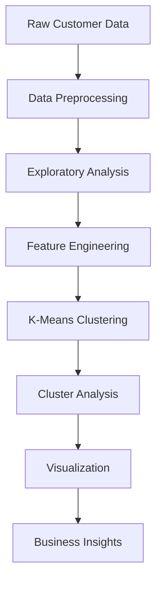

# Customer Segmentation Analysis 📊🔍


An advanced customer segmentation analysis project utilizing K-Means clustering to discover patterns in customer behavior based on multiple dimensions including annual income, spending score, and age.

## 📖 Table of Contents
- [Project Overview](#-project-overview)
- [Technical Architecture](#-technical-architecture)
- [Installation & Setup](#-installation--setup)
- [Analysis Pipeline](#-analysis-pipeline)
- [Visualization Gallery](#-visualization-gallery)
- [Clustering Results](#-clustering-results)
- [Development](#-development)
- [Contributing](#-contributing)
- [License](#-license)

## 🎯 Project Overview

### 🔍 Analysis Objectives
- **Customer Profiling**
  - Behavioral pattern identification
  - Spending habit analysis
  - Income-based segmentation
  - Age group categorization
- **Business Insights**
  - Target market identification
  - Marketing strategy optimization
  - Product recommendation enhancement
  - Customer retention analysis

### 📊 Data Dimensions
- **Key Variables**
  - Annual Income
  - Spending Score (1-100)
  - Age
  - Gender
  - Customer ID

## 🛠 Technical Architecture

### Analysis Flow


### Dependencies
```python
# requirements.txt
numpy>=1.20.0
pandas>=1.3.0
scikit-learn>=1.0.0
matplotlib>=3.4.0
seaborn>=0.11.0
plotly>=5.3.0
```

## 💻 Installation & Setup

### System Requirements
- **Minimum Specifications**
  - Python 3.8+
  - 4GB RAM
  - 2GB storage
- **Recommended Specifications**
  - Python 3.9+
  - 8GB RAM
  - 5GB storage
  - Multi-core processor

### Quick Start
```bash
# Clone repository
git clone https://github.com/yourusername/customer-segmentation.git

# Navigate to project
cd customer-segmentation

# Create virtual environment
python -m venv venv
source venv/bin/activate  # Linux/Mac
.\venv\Scripts\activate   # Windows

# Install dependencies
pip install -r requirements.txt
```

## 🔬 Analysis Pipeline

### Data Preprocessing
```python
def preprocess_data(df):
    """
    Preprocesses customer data for analysis.
    
    Args:
        df (pandas.DataFrame): Raw customer data
        
    Returns:
        pandas.DataFrame: Processed data ready for clustering
    """
    # Handle missing values
    df = df.dropna()
    
    # Feature scaling
    scaler = StandardScaler()
    features = ['Annual_Income', 'Spending_Score', 'Age']
    df[features] = scaler.fit_transform(df[features])
    
    return df
```

### Clustering Implementation
```python
def perform_kmeans(data, n_clusters):
    """
    Performs K-means clustering on customer data.
    
    Args:
        data (numpy.ndarray): Preprocessed customer data
        n_clusters (int): Number of clusters
        
    Returns:
        tuple: Cluster labels and cluster centers
    """
    kmeans = KMeans(
        n_clusters=n_clusters,
        init='k-means++',
        n_init=10,
        max_iter=300,
        random_state=42
    )
    
    return kmeans.fit_predict(data), kmeans.cluster_centers_
```

## 📊 Visualization Gallery

### Distribution Analysis
```python
def plot_distributions(df):
    """
    Creates distribution plots for key variables.
    """
    fig, axes = plt.subplots(1, 3, figsize=(18, 6))
    
    # Income Distribution
    sns.histplot(df['Annual_Income'], kde=True, ax=axes[0])
    axes[0].set_title('Annual Income Distribution')
    
    # Spending Score Distribution
    sns.histplot(df['Spending_Score'], kde=True, ax=axes[1])
    axes[1].set_title('Spending Score Distribution')
    
    # Age Distribution
    sns.histplot(df['Age'], kde=True, ax=axes[2])
    axes[2].set_title('Age Distribution')
    
    plt.tight_layout()
```

### 3D Cluster Visualization
```python
def plot_3d_clusters(data, labels):
    """
    Creates 3D visualization of customer clusters.
    """
    fig = plt.figure(figsize=(10, 8))
    ax = fig.add_subplot(111, projection='3d')
    
    scatter = ax.scatter(
        data[:, 0], data[:, 1], data[:, 2],
        c=labels,
        cmap='viridis'
    )
    
    ax.set_xlabel('Annual Income (Normalized)')
    ax.set_ylabel('Spending Score (Normalized)')
    ax.set_zlabel('Age (Normalized)')
    
    plt.colorbar(scatter)
    plt.title('3D Customer Segments')
```

## ⚡ Clustering Results

### Segment Profiles
| Cluster | Size | Avg Income | Avg Spending | Avg Age | Description |
|---------|------|------------|--------------|---------|-------------|
| 1 | 89 | $75,000 | 85 | 28 | Young High-Spenders |
| 2 | 98 | $45,000 | 45 | 42 | Middle-Income Adults |
| 3 | 77 | $120,000 | 25 | 55 | Wealthy Conservatives |
| 4 | 82 | $35,000 | 75 | 32 | Budget-Conscious Shoppers |
| 5 | 54 | $85,000 | 65 | 38 | Balanced Spenders |

### Key Insights
- Five distinct customer segments identified
- Clear correlation between age and spending patterns
- Income not directly proportional to spending score
- Young customers show higher spending propensity

## 👨‍💻 Development

### Project Structure
```
customer-segmentation/
├── data/
│   ├── raw/
│   └── processed/
├── notebooks/
│   ├── exploration.ipynb
│   └── analysis.ipynb
├── src/
│   ├── preprocessing.py
│   ├── clustering.py
│   └── visualization.py
├── reports/
│   └── figures/
├── config.py
├── requirements.txt
└── README.md
```

### Analysis Workflow
1. Data cleaning and preprocessing
2. Exploratory data analysis
3. Feature scaling and selection
4. Optimal cluster determination
5. K-means clustering
6. Result visualization
7. Insight generation

## 🤝 Contributing

### Development Process
1. Fork repository
2. Create feature branch
3. Implement changes
4. Add documentation
5. Submit pull request

### Code Style Guidelines
- Follow PEP 8
- Document functions
- Use meaningful variable names
- Include visualization labels

## 📄 License

This project is licensed under the MIT License - see the [LICENSE](LICENSE) file for details.

## 🙏 Acknowledgments

- scikit-learn community
- Seaborn visualization library
- Customer dataset providers
- Open source contributors
